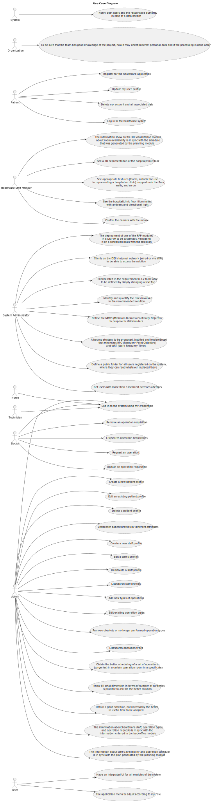
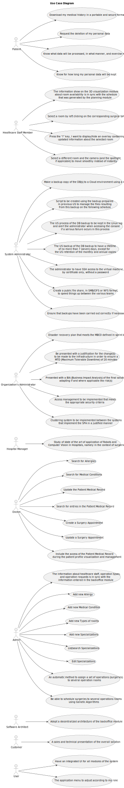
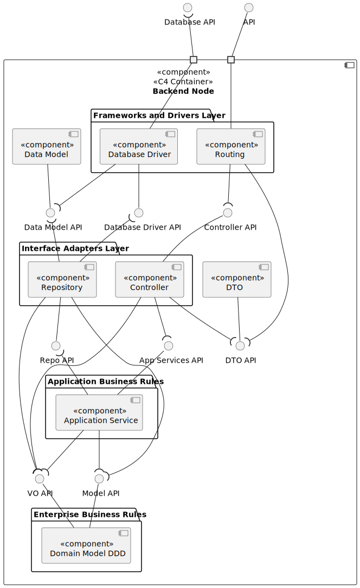
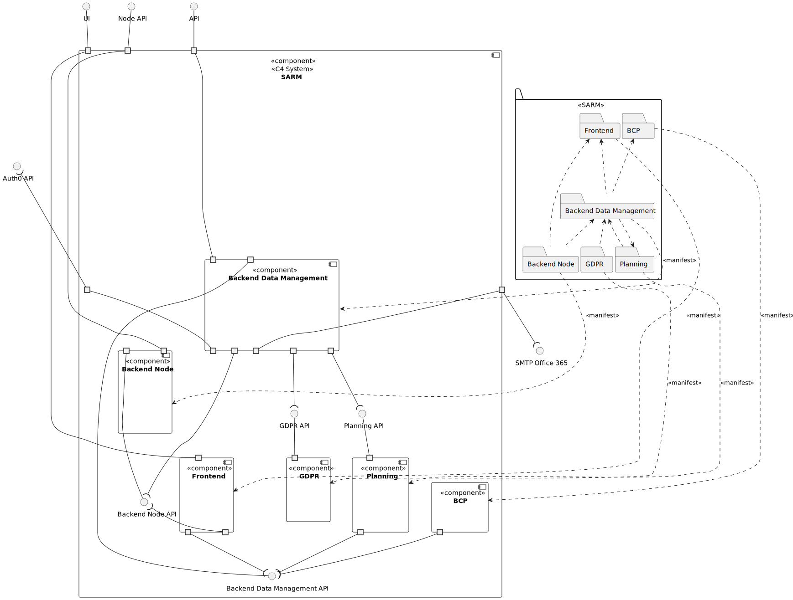
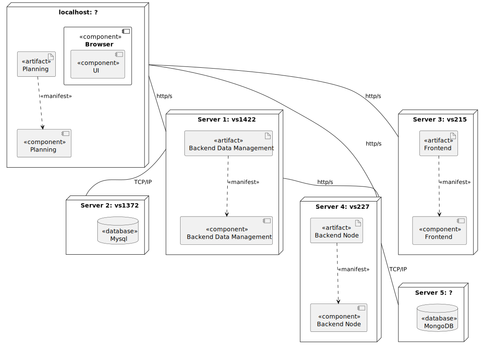
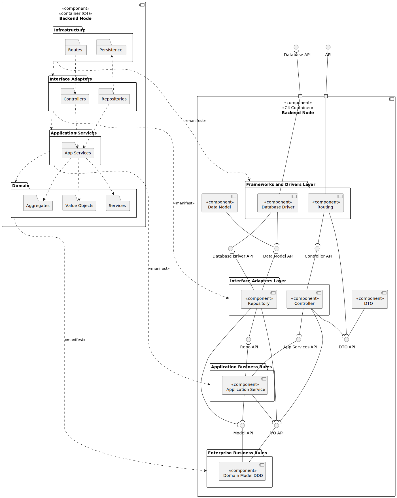

# LAPR5 - Group 20 

## Use Case Diagram

### Sprint A

~

### Sprint B

### Sprint C

## Domain Model

## View

### Level 1

#### Logic View

### Level 2

#### Logic View

#### Implementation View

#### Physical View

### Level 3

#### Backend Data Management

#### Logic View

#### Implementation View

#### Backend Node

#### Logic View

#### Implementation View

#### Frontend

#### Logic View

#### Implementation View

### Mapping

#### Level 2

#### Logic View - Implementation View

#### Logic View - Physical View

#### Level 3

#### Backend Data Management

#### Backend Node

#### Frontend

## Group Members

| Student Nr. | Name            |
| ----------- | --------------- |
|1220829      | Diogo Ferreira  |
|1220846      | Francisco Osório|
|1220890      | Sérgio Moreira  |
|1221104      | Rafael Ferraz   |

## Tasks Assigment

### Sprint A

| Student Nr. | Name            |Tasks Assigment |
| ----------- | --------------- |--------------- |
|1220829      | Diogo Ferreira  | [US-5.1.8](sprint-a/us-5.1.8/readme.md) [US-5.1.9](sprint-a/us-5.1.9/readme.md) [US-5.1.10](sprint-a/us-5.1.10/readme.md)  [US-5.1.11](sprint-a/us-5.1.11/readme.md)  [US-5.1.21](sprint-a/us-5.1.21/readme.md)            |
|1220846      | Francisco Osório|[US-5.1.3](sprint-a/us-5.1.3/readme.md) [US-5.1.4](sprint-a/us-5.1.4/readme.md) [US-5.1.5](sprint-a/us-5.1.5/readme.md)  [US-5.1.7](sprint-a/us-5.1.7/readme.md)  [US-5.1.20](sprint-a/us-5.1.20/readme.md) [US-5.1.22](sprint-a/us-5.1.22/readme.md) [US-5.1.23](sprint-a/us-5.1.23/readme.md)                |
|1220890      | Sérgio Moreira  | [US-5.1.1](sprint-a/us-5.1.1/readme.md) [US-5.1.2](sprint-a/us-5.1.2/readme.md) [US-5.1.6](sprint-a/us-5.1.6/readme.md)  [US-5.1.16](sprint-a/us-5.1.16/readme.md)  [US-5.1.17](sprint-a/us-5.1.17/readme.md) [US-5.1.19](sprint-a/us-5.1.19/readme.md)  |
|1221104      | Rafael Ferraz   |  [US-5.1.12](sprint-a/us-5.1.12/readme.md) [US-5.1.13](sprint-a/us-5.1.13/readme.md) [US-5.1.14](sprint-a/us-5.1.14/readme.md)  [US-5.1.15](sprint-a/us-5.1.15/readme.md)  [US-5.1.18](sprint-a/us-5.1.18/readme.md)   |

### Sprint B

| Student Nr. | Name            |Tasks Assigment |
| ----------- | --------------- |--------------- |
|1220829      | Diogo Ferreira  | [US-6.2.6](sprint-b/us-6.2.6/readme.md) [US-6.2.7](sprint-b/us-6.2.7/readme.md) [US-6.2.8](sprint-b/us-6.2.8/readme.md)  [US-6.2.9](sprint-b/us-5.2.9/readme.md)  [US-6.2.19](sprint-b/us-6.2.19/readme.md)            |
|1220846      | Francisco Osório|[US-6.2.1](sprint-b/us-6.2.1/readme.md) [US-6.2.2](sprint-b/us-6.2.2/readme.md) [US-6.2.3](sprint-b/us-6.2.3/readme.md)  [US-6.2.5](sprint-b/us-6.2.5/readme.md)  [US-6.2.18](sprint-b/us-6.2.18/readme.md) [US-6.2.21](sprint-b/us-6.2.21/readme.md)        |
|1220890      | Sérgio Moreira  | [US-6.2.4](sprint-b/us-6.2.4/readme.md) [US-6.2.14](sprint-b/us-6.2.14/readme.md) [US-6.2.15](sprint-b/us-5.2.15/readme.md)  [US-6.2.17](sprint-b/us-6.2.17/readme.md)  [US-6.2.20](sprint-b/us-6.2.20/readme.md) |
|1221104      | Rafael Ferraz   |  [US-6.2.10](sprint-b/us-6.2.10/readme.md) [US-6.2.11](sprint-b/us-6.2.11/readme.md) [US-6.2.12](sprint-b/us-6.2.12/readme.md)  [US-6.2.13](sprint-b/us-6.2.13/readme.md)  [US-6.2.16](sprint-b/us-6.2.16/readme.md)   |