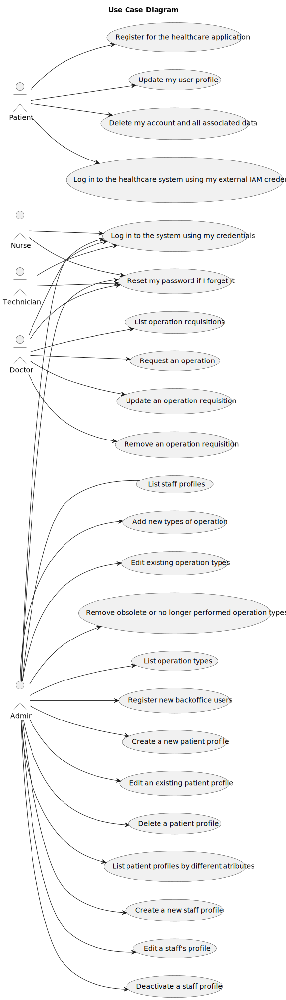
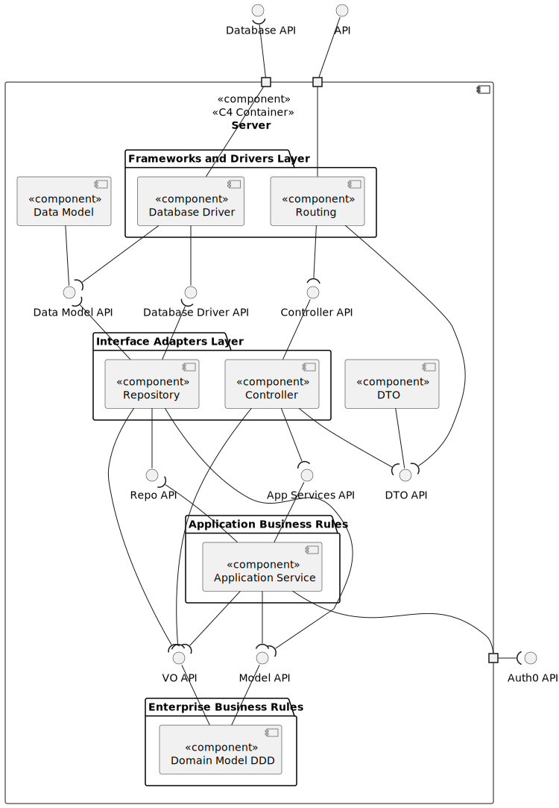

# LAPR5 - Group 20 

## Use Case Diagram

## Domain Model

## View

### Level 1

#### Logic View

### Level 2

#### Logic View

#### Implementation View

### Level 3

#### Logic View

#### Implementation View

## Group Members

| Student Nr. | Name            |
| ----------- | --------------- |
|1220829      | Diogo Ferreira  |
|1220846      | Francisco Osório|
|1220890      | Sérgio Moreira  |
|1221104      | Rafael Ferraz   |

## Tasks Assigment

### Sprint A

| Student Nr. | Name            |Tasks Assigment |
| ----------- | --------------- |--------------- |
|1220829      | Diogo Ferreira  |                |
|1220846      | Francisco Osório|[US-5.1.3](sprint-a/us-5.1.3/readme.md) [US-5.1.4](sprint-a/us-5.1.4/readme.md) [US-5.1.5](sprint-a/us-5.1.5/readme.md)  [US-5.1.7](sprint-a/us-5.1.7/readme.md)  [US-5.1.20](sprint-a/us-5.1.20/readme.md) [US-5.1.22](sprint-a/us-5.1.22/readme.md) [US-5.1.23](sprint-a/us-5.1.23/readme.md)                |
|1220890      | Sérgio Moreira  |                |
|1221104      | Rafael Ferraz   |                |