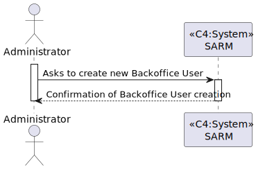
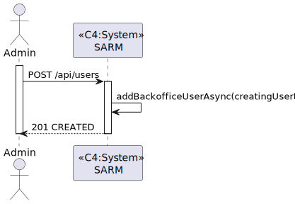
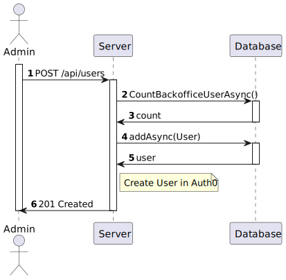
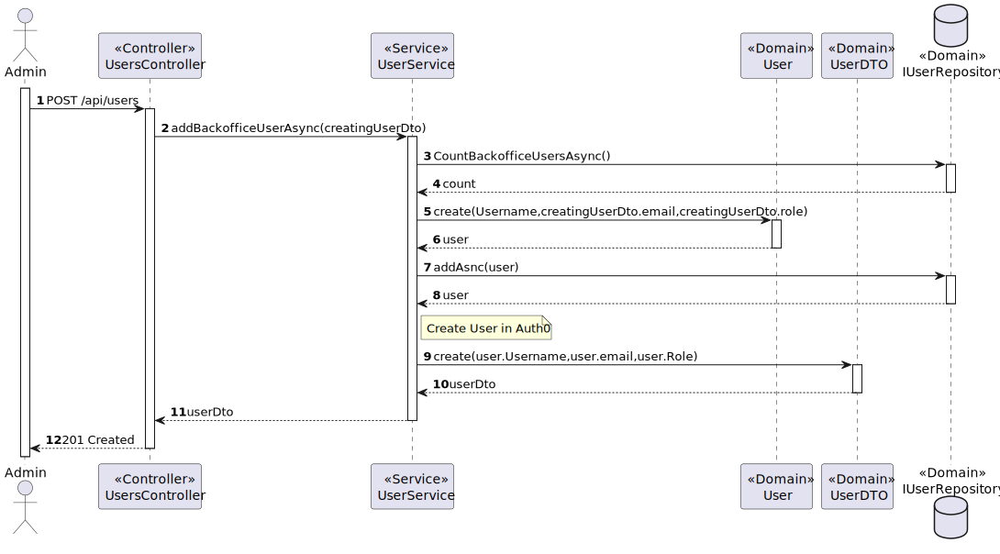

# US 5.1.1 - As an Admin, I want to register new backoffice users (e.g., doctors, nurses, technicians, admins) via an out-of-band process.

## 1. Context

In this task it was proposed that an Admin can register new backoffice users via an out-of-band process.

## 2. Requirements

*US 5.1.1* As an Admin, I want to register new backoffice users (e.g., doctors, nurses, technicians, admins) via an out-of-band process, so that they can access the backoffice system with appropriate permissions.

 - Backoffice users (e.g., doctors, nurses, technicians) are registered by an Admin via an internal process, not via self-registration.
 - Admin assigns roles (e.g., Doctor, Nurse, Technician) during the registration process.
 - Registered users receive a one-time setup link via email to set their password and activate their account.
 - The system enforces strong password requirements for security.
 - A confirmation email is sent to verify the user’s registration.

## 3. Views

### Level 1

### Level 2

### Level 3

