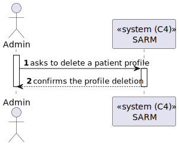
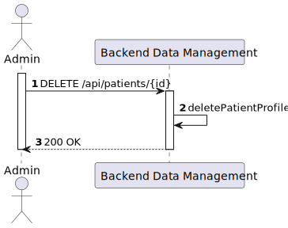
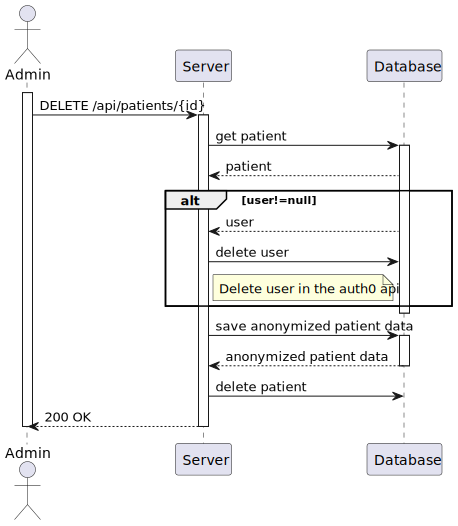
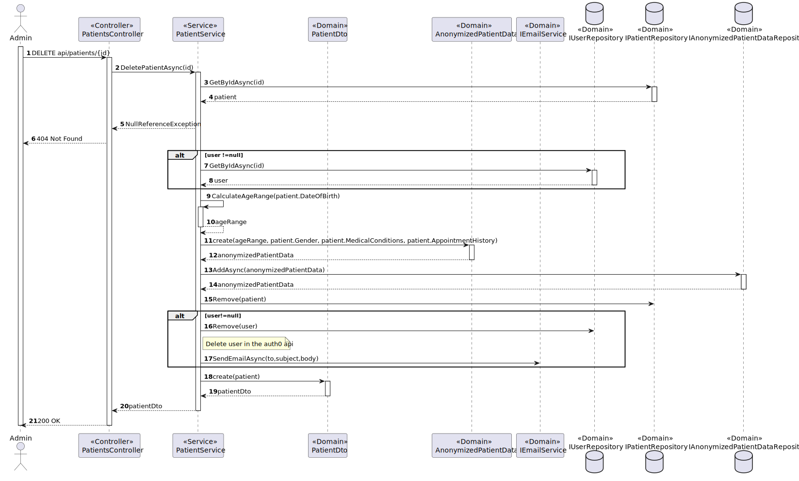

# US 5.1.10 - Delete patient profile

##  1. Content

*In this task it was proposed that an Admin can delete a patient profile*

## 2. Requirements

**US 5.1.10**  As an Admin, I want to delete a patient profile, so that I can remove patients who are no longer under care.

- Admins can search for a patient profile and mark it for deletion.
- Before deletion, the system prompts the admin to confirm the action.
- Once deleted, all patient data is permanently removed from the system within a predefined time frame.

## 3. Views

### Level 1

### Level 2

### Level 3

