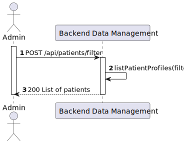

# US 5.1.11 - List/search patient profile

##  1. Content

*In this task it was proposed that an Admin can create a patient profile*

## 2. Requirements

**US 5.1.11**  As an Admin, I want to list/search patient profiles by different attributes, so that I can view the details, edit, and remove patient profiles.

- Admins can search patient profiles by various attributes, including name, email, date of birth, or medical record number.
- The system displays search results in a list view with key patient information (name, email, date of birth).
- Admins can select a profile from the list to view, edit, or delete the patient record.
- The search results are paginated, and filters are available to refine the search results.

## 3. Views

### Level 1

### Level 2

### Level 3

