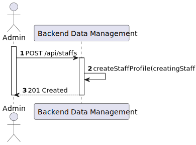
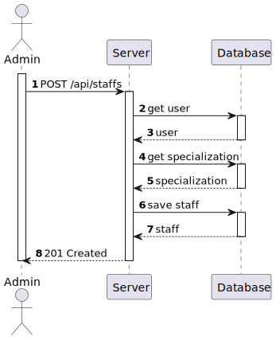
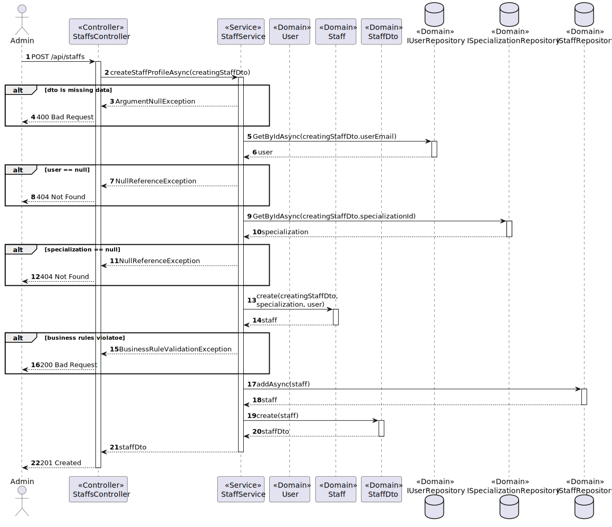

# US 5.1.12 - Create new staff profile

##  1. Content

*In this task it was proposed that an Admin can create a staff profile*

## 2. Requirements

**US 5.1.12**  As an Admin, I want to create a new staff profile, so that I can add them to the hospital’s roster.

- Admins can input staff details such as first name, last name, contact information, and specialization.
- A unique staff ID (License Number) is generated upon profile creation.
- The system ensures that the staff’s email and phone number are unique.
- The profile is stored securely, and access is based on role-based permissions.

## 3. Views

### Level 1

### Level 2

### Level 3

