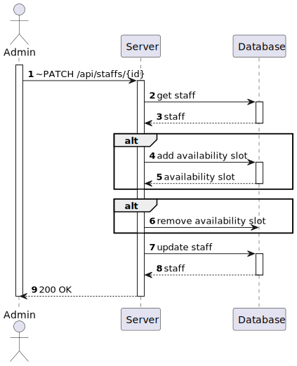
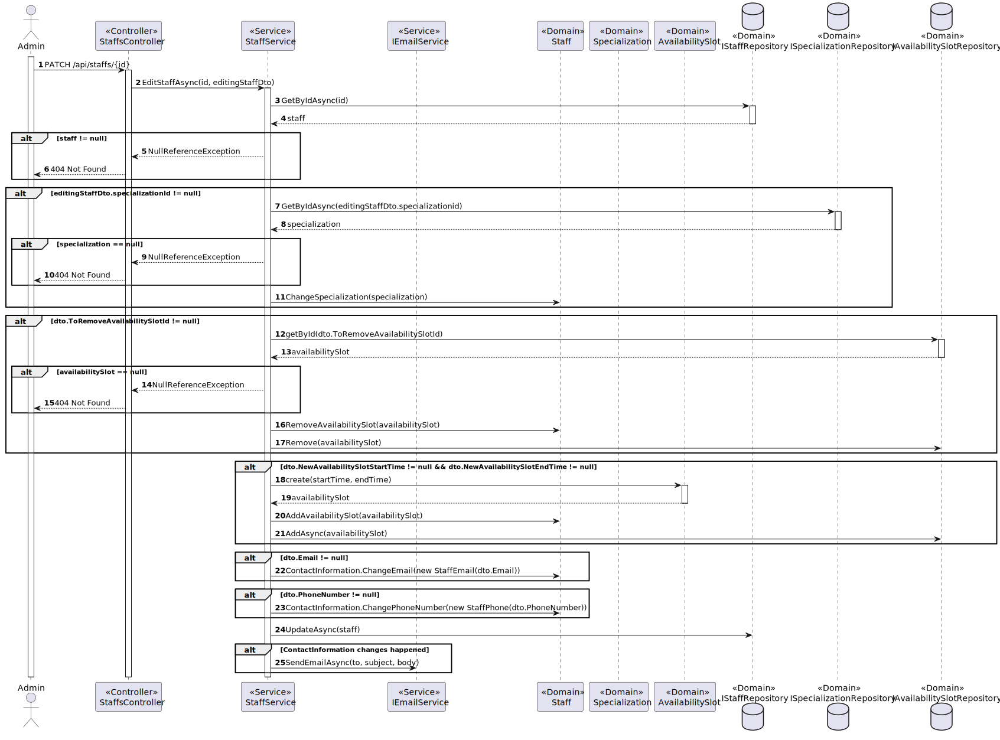

# US 5.1.13 - Edit a staff profile

## 1. Content

*In this task it was proposed that an Admin can edit a staff profile*

## 2. Requirement

**US 5.1.13**  As an Admin, I want to edit a staff’s profile, so that I can update their information.

- Admins can search for and select a staff profile to edit.
- Editable fields include contact information, availability slots, and specialization.
- The system logs all profile changes, and any changes to contact information trigger a
confirmation email to the staff member.
- The edited data is updated in real-time across the system.

## 3. Views

### Level 1

### Level 2

### Level 3

