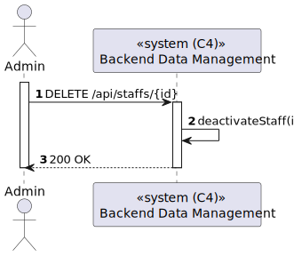

# US 5.1.14 - Deactivate a staff profile

## 1. Content

*In this task it was proposed that an Admin can deactivate a staff profile*

## 2. Requirement

**US 5.1.14** As an Admin, I want to deactivate a staff profile, so that I can remove them from the hospital’s active roster without losing their historical data.

- Admins can search for and select a staff profile to deactivate.
- Deactivating a staff profile removes them from the active roster, but their historical data (e.g.,
appointments) remains accessible.
- The system confirms deactivation and records the action for audit purposes.

## 3. Views

### Level 1

### Level 2

### Level 3

