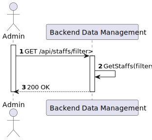
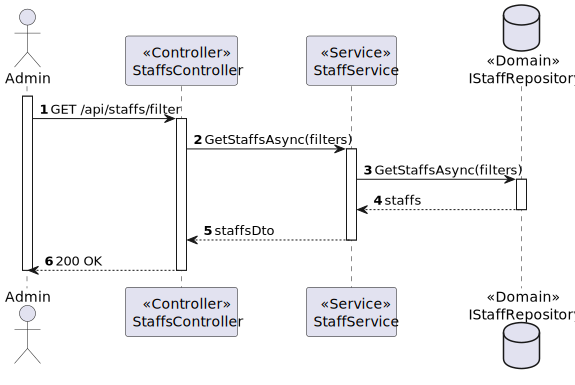

# US 5.1.15 - Create list/search staff profiles

##  1. Content

*In this task it was proposed that an Admin can list and search staff profils*

## 2. Requirements

**US 5.1.12**  As an Admin, I want to list/search staff profiles, so that I can see the details, edit, and remove staff profiles.

- Admins can search staff profiles by attributes such as name, email, or specialization.
- The system displays search results in a list view with key staff information (name, email, specialization).
- Admins can select a profile from the list to view, edit, or deactivate.
- The search results are paginated, and filters are available for refining the search results.

## 3. Views

### Level 1

### Level 2

### Level 3

