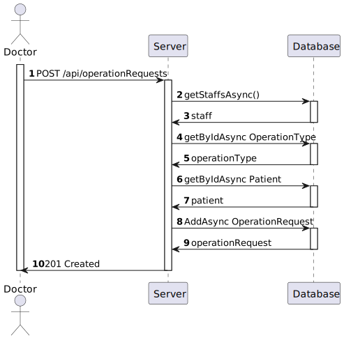

# US 5.1.16 - As a Doctor, I want to request an operation.

## 1. Context

In this task it was proposed that a Pacient request one operation on the system.

## 2. Requirements

*US 5.1.16* As a Doctor, I want to request an operation, so that the Patient has access to the necessary healthcare.

Acceptance Criteria:

 - Doctors can create an operation request by selecting the patient, operation type, priority, and suggested deadline.
 - The system validates that the operation type matches the doctor’s specialization.
 - The operation request includes: Patient ID, Doctor ID, Operation Type, Deadline, Priority
 - The system confirms successful submission of the operation    request and logs the request in the patient’s medical history.

## 3. Views

### Level 1

### Level 2

### Level 3

