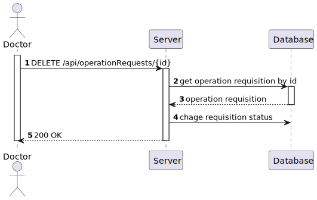

# US 5.1.18 - Remove an operation requisition

## 1. Content

*In this task it was proposed that a Doctor can remove an operation requisition*

## 2. Requirement

**US 5.1.18** As a Doctor, I want to remove an operation requisition, so that the healthcare activities are provided as necessary.

- Doctors can delete operation requests they created if the operation has not yet been
scheduled.
- A confirmation prompt is displayed before deletion.
- Once deleted, the operation request is removed from the patient’s medical record and cannot
be recovered.
- The system notifies the Planning Module and updates any schedules that were relying on this
request.

## 3. Views

### Level 1

### Level 2

### Level 3

