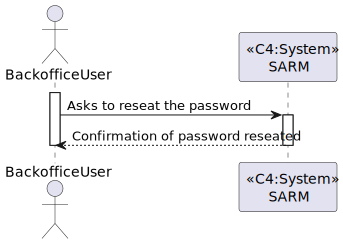

# US 5.1.2 - As a Backoffice User, I want to reset my password if I forget it.

## 1. Context

In this task it was proposed that a Backoffice User can reset the password if he forgot it.

## 2. Requirements

*US 5.1.2* As a Backoffice User (Admin, Doctor, Nurse, Technician), I want to reset my password if I forget it, so that I can regain access to the system securely.

 - Backoffice users can request a password reset by providing their email.
 - The system sends a password reset link via email.
 - The reset link expires after a predefined period (e.g., 24 hours) for security.
 - Users must provide a new password that meets the system’s password complexity rules.

## 3. Views

### Level 1

### Level 2

### Level 3

