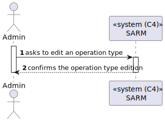

# US 5.1.21 - Edit existing types of operations

## 1. Context

*In this task it was proposed that a Admin can edit existing types of operations.*

## 2. Requirements

**US 5.1.21** As an Admin, I want to edit existing operation types, so that I can update or correct
information about the procedure.

- Admins can search for and select an existing operation type to edit.
- Editable fields include operation name, required staff by specialization, and estimated
duration.
- Changes are reflected in the system immediately for future operation requests.
- Historical data is maintained, but new operation requests will use the updated operation type
information.

## 3. Views

### Level 1

### Level 2

### Level 3

