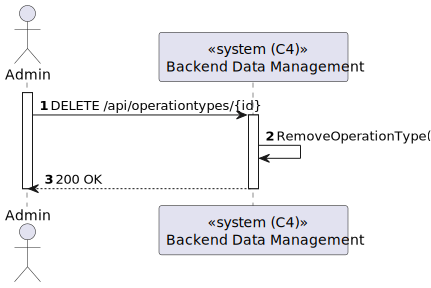
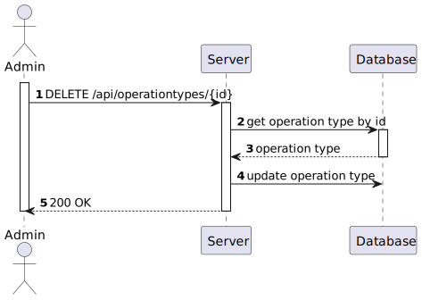

# US 5.1.22 - Remove obsolete or no longer performed operation types.

## 1. Context

*In this task it was proposed that a Admin can remove obsolete or no longer performed operation types.*

## 2. Requirements

**US 5.1.22** As an Admin, I want to remove obsolete or no longer performed operation types, so that the system stays current with hospital practices.

- Admins can search for and mark operation types as inactive (rather than deleting them) to preserve historical records.
- Inactive operation types are no longer available for future scheduling but remain in historical data.
- A confirmation prompt is shown before deactivating an operation type.

## 3. Views

### Level 1

### Level 2

### Level 3

