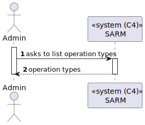

# US 5.1.3 - List operation types

## 1. Context

*In this task it was proposed that a Admin can list operation types.*

## 2. Requirements

**US 5.1.20** As an Admin, I want to list/search operation types, so that I can see the details, edit, and remove operation types.

 - Admins can search and filter operation types by name, specialization, or status(active/inactive).
 - The system displays operation types in a searchable list with attributes such as name, required staff, and estimated duration.
 - Admins can select an operation type to view, edit, or deactivate it.

## 3. Views

### Level 1

### Level 2

