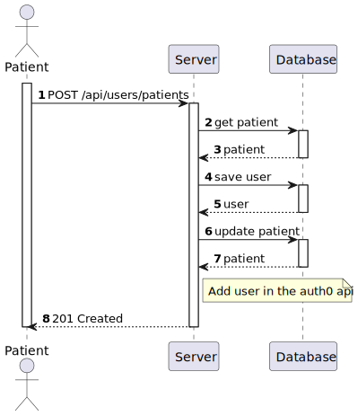
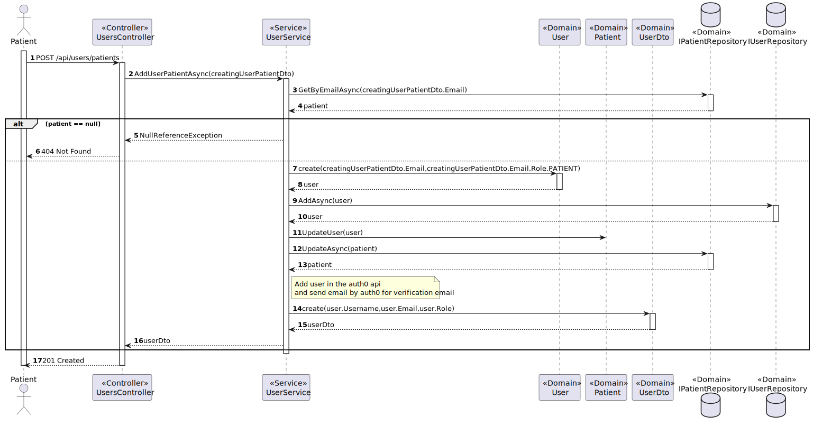

# US 5.1.3 - Register a patient in the healthcare application

## 1. Context

*In this task it was proposed that a Patient can register for the healthcare application.*

## 2. Requirements

**US 5.1.3** As a Patient, I want to register for the healthcare application, so that I can create a user profile and book appointments online.

 - Patients can self-register using the external IAM system.
 - During registration, patients provide personal details (e.g., name, email, phone) and create a profile.
 - The system validates the email address by sending a verification email with a confirmation link.
 - Patients cannot list their appointments without completing the registration process.
 - The patient profile must have previously been created in the system by an administrator

## 3. Views

### Level 1

### Level 2

### Level 3

