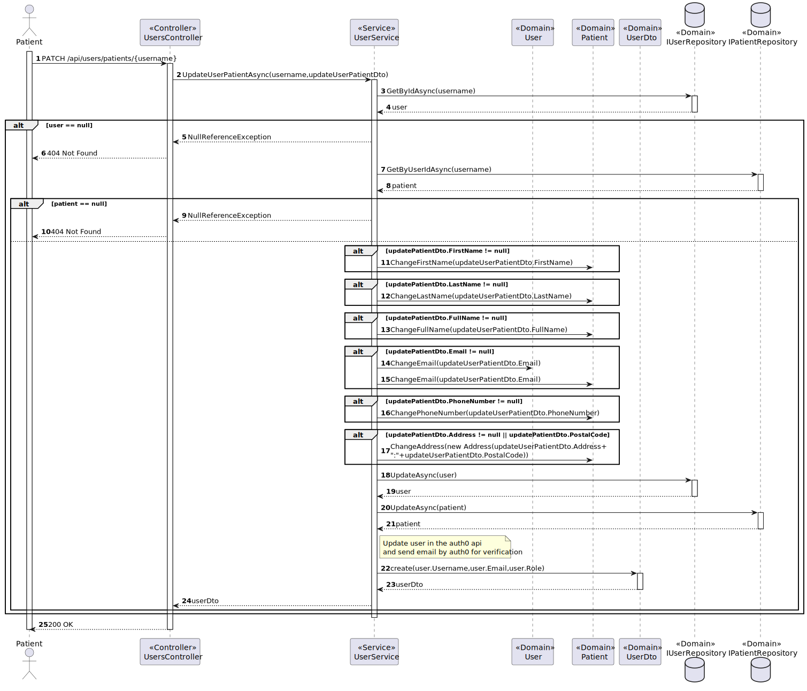

# US 5.1.4 - Update my user patient profile

## 1. Context

*In this task it was proposed that a Patient can update my user patient profile*

## 2. Requirements

**US 5.1.4**As a Patient, I want to update my user profile, so that I can change my personal details and preferences.

- Patients can log in and update their profile details (e.g., name, contact information, preferences).
- Changes to sensitive data, such as email, trigger an additional verification step (e.g., confirmation email).
- All profile updates are securely stored in the system.
- The system logs all changes made to the patient's profile for audit purposes.

## 3. Views

### Level 1

### Level 2

### Level 3

