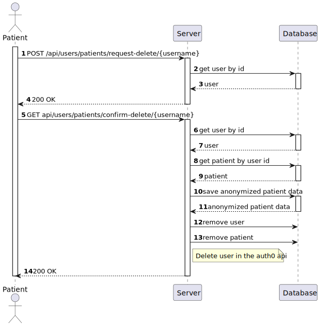
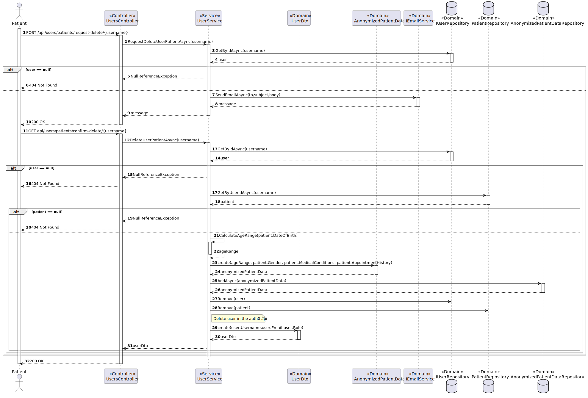

# US 5.1.5 - Delete my account and all associated data

## 1. Context

*In this task it was proposed that a Patient can delete your account and all associated data*

## 2. Requirements

**US 5.1.5** As a Patient, I want to delete my account and all associated data, so that I can exercise my right to be forgotten as per GDPR.

- Patients can request to delete their account through the profile settings.
- The system sends a confirmation email to the patient before proceeding with account deletion.
- Upon confirmation, all personal data is permanently deleted from the system within the legally required time frame (e.g., 30 days).
- Patients are notified once the deletion is complete, and the system logs the action for GDPR compliance.
- Some anonymized data may be retained for legal or research purposes, but all identifiable
information is erased.

## 3. Views

### Level 1

### Level 2

### Level 3

