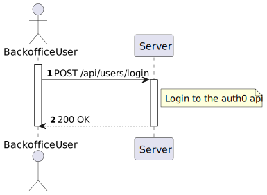

# US 5.1.6 - As a  Backoffice User, I want to log in to the system using my credentials users.

## 1. Context

In this task it was proposed that a Backoffice User can log in to the system with your credentials.

## 2. Requirements

*US 5.1.6* As a (non-authenticated) Backoffice User, I want to log in to the system using my credentials, so that I can access the backoffice features according to my assigned role.

 - Backoffice users log in using their username and password.
 - Role-based access control ensures that users only have access to features appropriate to their role (e.g., doctors can manage appointments, admins can manage users and settings).
 - After five failed login attempts, the user account is temporarily locked, and a notification is sent to the admin.
 - Login sessions expire after a period of inactivity to ensure security.

## 3. Views

### Level 1

### Level 2

### Level 3

