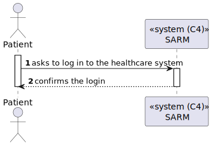
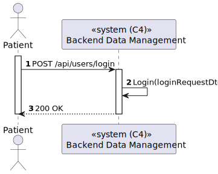
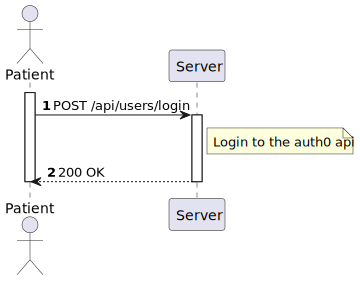
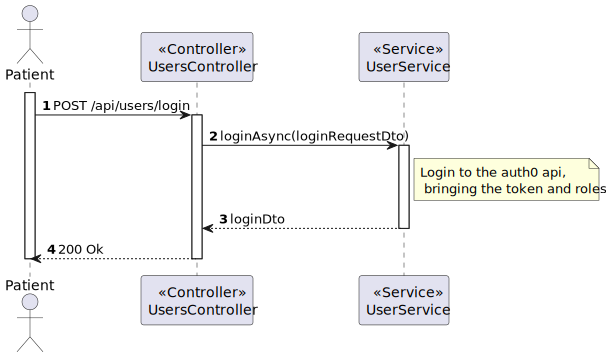

# US 5.1.7 - Log in to the healthcare system using my external IAM credentials

## 1. Context

*In this task it was proposed that a Patient can log in to the healthcare system using your external IAM credentials*

## 2. Requirements

**US 5.1.7** As a Patient, I want to log in to the healthcare system using my external IAM credentials, so that I can access my appointments, medical records, and other features securely.

- Patients log in via an external Identity and Access Management (IAM) provider (e.g., Google, Facebook, or hospital SSO).
- After successful authentication via the IAM, patients are redirected to the healthcare system with a valid session.
- Patients have access to their appointment history, medical records, and other features relevant to their profile.
- Sessions expire after a defined period of inactivity, requiring reauthentication.

## 3. Views

### Level 1

### Level 2

### Level 3

