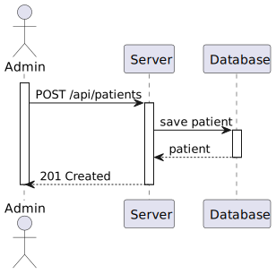
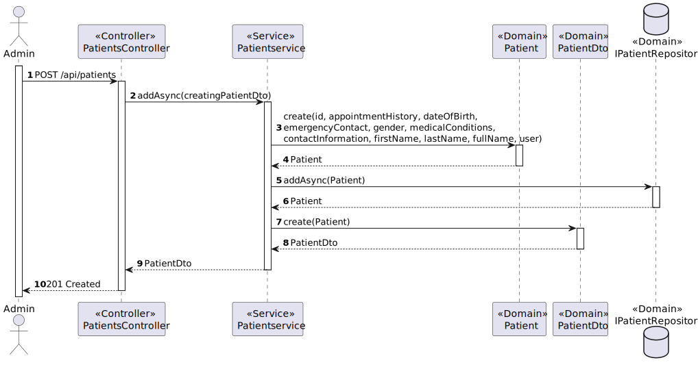

# US 5.1.8 - Create new patient profile

##  1. Content

*In this task it was proposed that an Admin can create a patient profile*

## 2. Requirements

**US 5.1.8**  As an Admin, I want to create a new patient profile, so that I can register their personal details and medical history.

- Admins can input patient details such as first name, last name, date of birth, contact information, and medical history.
- A unique patient ID (Medical Record Number) is generated upon profile creation.
- The system validates that the patient’s email and phone number are unique.
- The profile is stored securely in the system, and access is governed by role-based permissions.

## 3. Views

### Level 1

### Level 2

### Level 3

