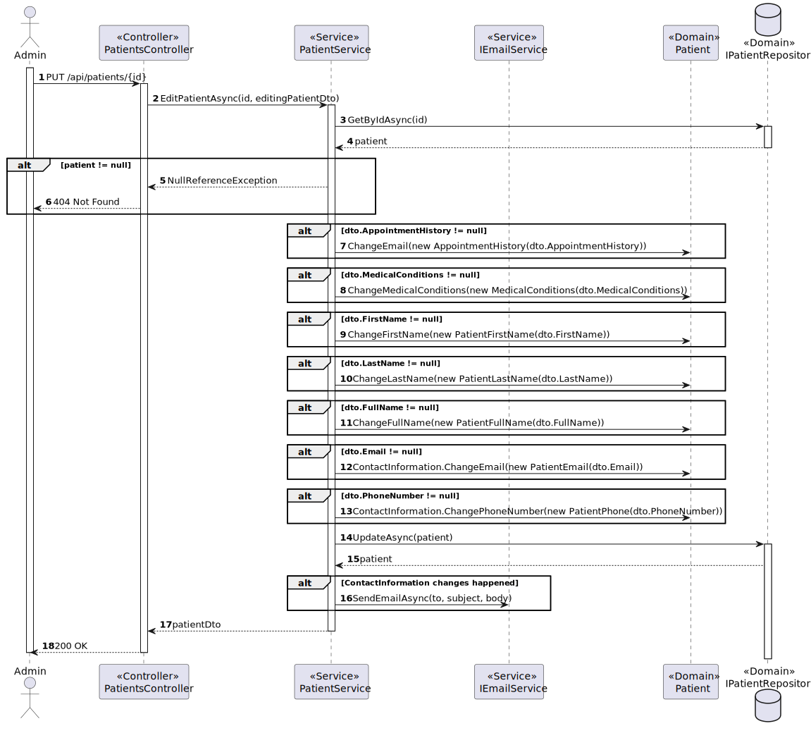

# US 5.1.9 - Edit patient profile

##  1. Content

*In this task it was proposed that an Admin can edit an existing patient profile*

## 2. Requirements

**US 5.1.9**  As an Admin, I want to edit an existing patient profile, so that I can update their information when needed.

- Admins can search for and select a patient profile to edit
- Editable fields include name, contact information, medical history, and allergies.
- Changes to sensitive data (e.g., contact information) trigger an email notification to the patient.
- The system logs all profile changes for auditing purposes.

## 3. Views

### Level 1

### Level 2

### Level 3

