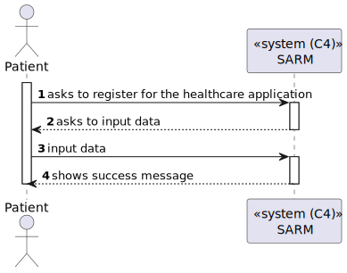
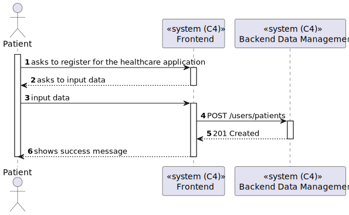
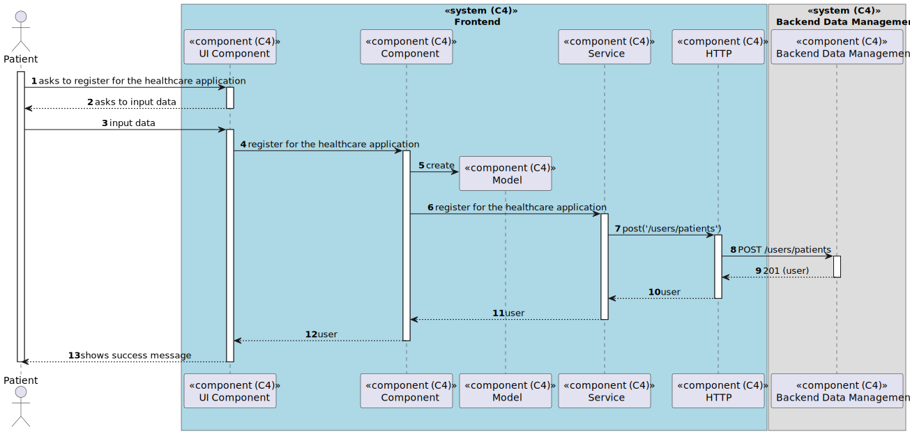

# US 6.2.1 - Register for the healthcare application

## 1. Context

*In this task it was proposed that a Patient can register for the healthcare application.*

## 2. Requirements

**US 6.2.1**As a Patient, I want to register for the healthcare application, so that I can create a user profile and book appointments online.

## 3. Views

### Level 1

### Level 2

### Level 3

