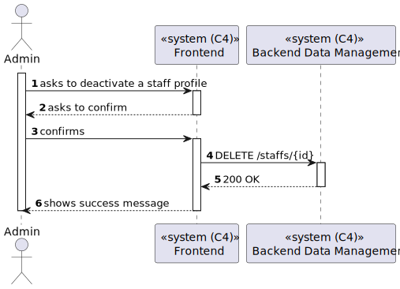

# US 6.2.12 - Deactivate a staff profile

## 1. Context

*In this task it was aksed that an Admin can deactivate a staff profile.*

## 2. Requirements

**US 6.2.12**  As an Admin, I want to deactivate a staff profile, so that I can remove them from the hospital’s active roster without losing their historical data.

## 3. Views

### Level 1

### Level 2

### Level 3

