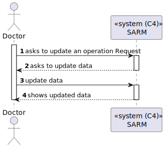
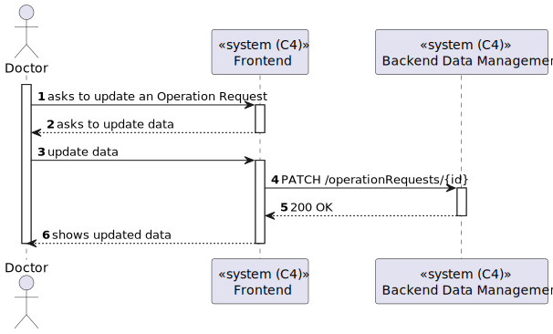
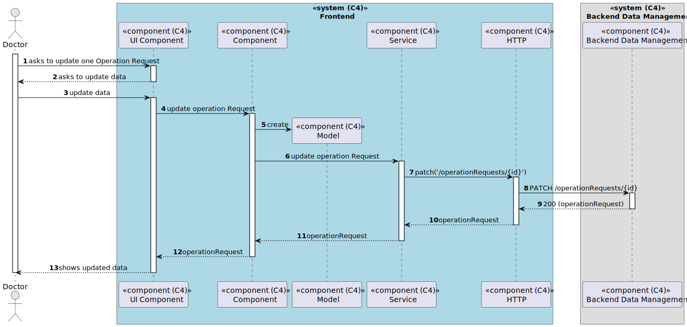

# US 6.2.15 - Update one Operation Request

## Context

*In this task it was aksed that a Doctor can update one Operation Request for one patient.*

## 2. Requirements

**US 6.2.15**  As a Doctor, I want to update an operation requisition, so that the Patient has access to the necessary healthcare.

## 3. Views

### Level 1

### Level 2

### Level 3

