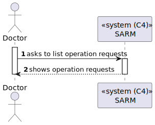
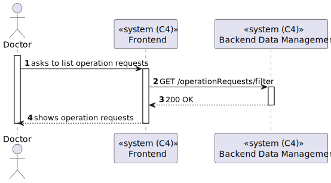
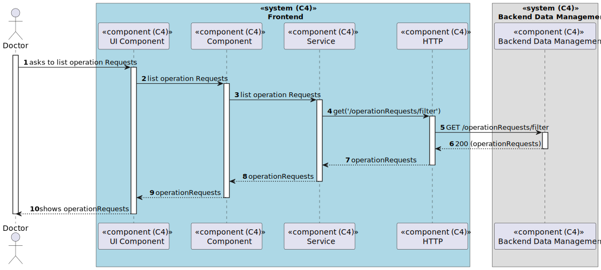

# US 6.2.17 - List Operartion Requests

## Context

*In this task it was aksed that an Admin can delete one Operation Type.*

## 2. Requirements

**US 6.2.17**  As an Admin, I want to remove obsolete or no longer performed operation types, so that the system stays current with hospital practices.

## 3. Views

### Level 1

### Level 2

### Level 3

