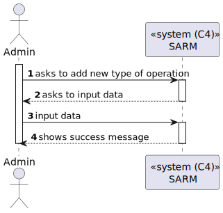
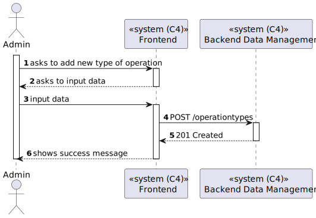
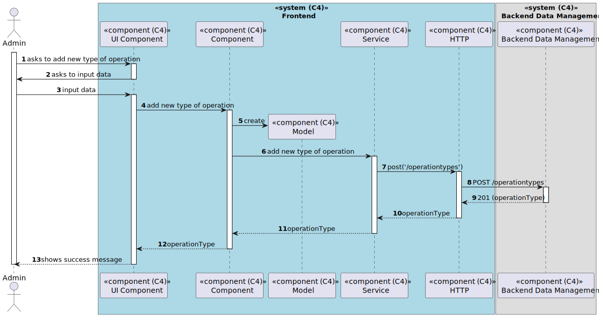

# US 6.2.18 - Add new types of operations

## 1. Context

*In this task it was proposed that a Admin can add new types of operations.*

## 2. Requirements

**US 6.2.18** As an Admin, I want to add new types of operations, so that I can reflect on the available medical procedures in the system.

## 3. Views

### Level 1

### Level 2

### Level 3

