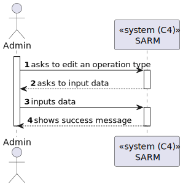
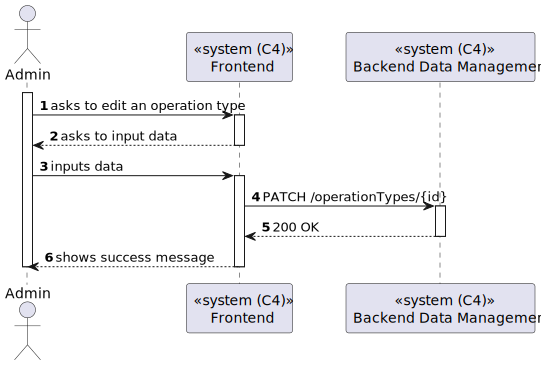
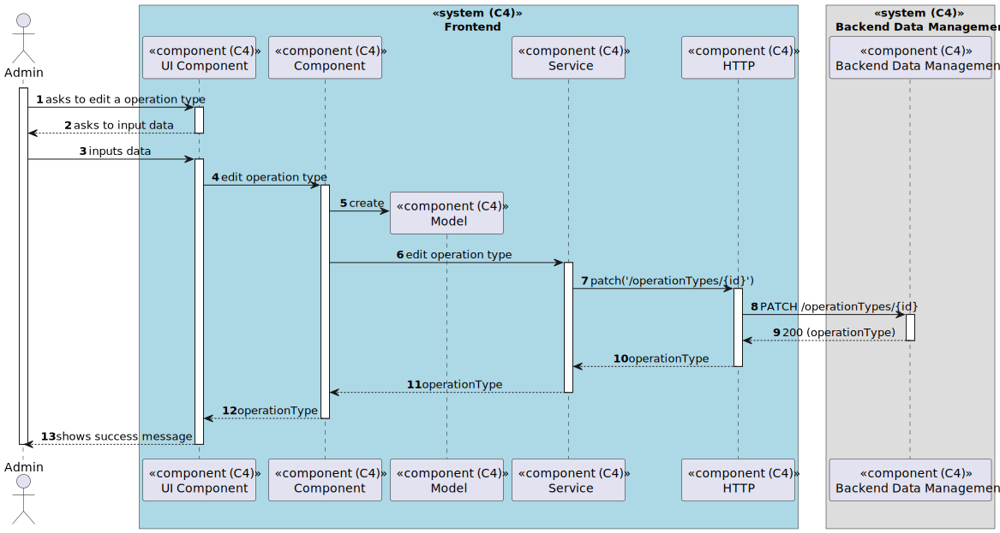

# US 6.2.19 - Edit Operation Types

## 1. Context

*In this task it was proposed that an Admin can edit existing Operation Types*

## 2. Requirements

**US 6.2.19** As an Admin, I want to edit existing operation types, so that I can update or correct
information about the procedure.

## 3. Views

### Level 1

### Level 2

### Level 3

