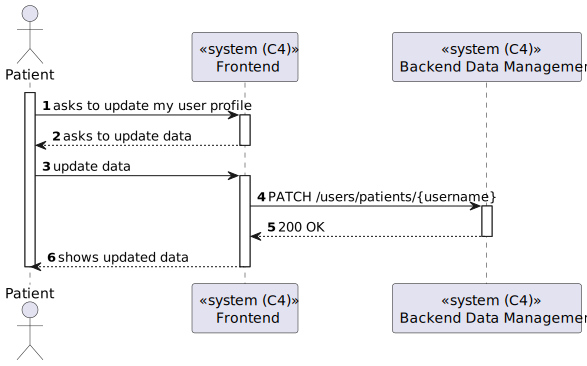
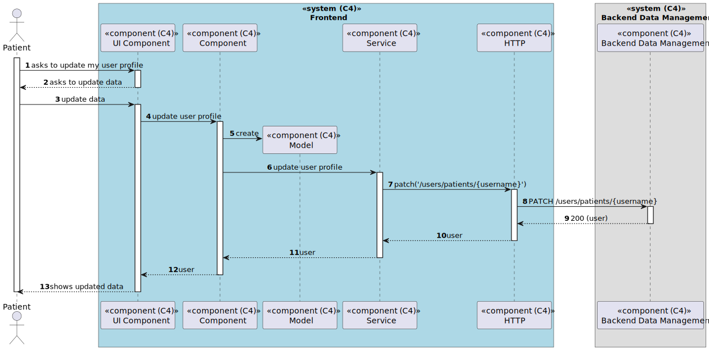

# US 6.2.2 - Update my user profile

## 1. Context

*In this task it was proposed that a Patient can update your user profile.*

## 2. Requirements

**US 6.2.2** As a Patient, I want to update my user profile, so that I can change my personal details and preferences.

## 3. Views

### Level 1

### Level 2

### Level 3

