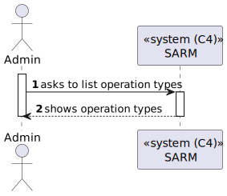
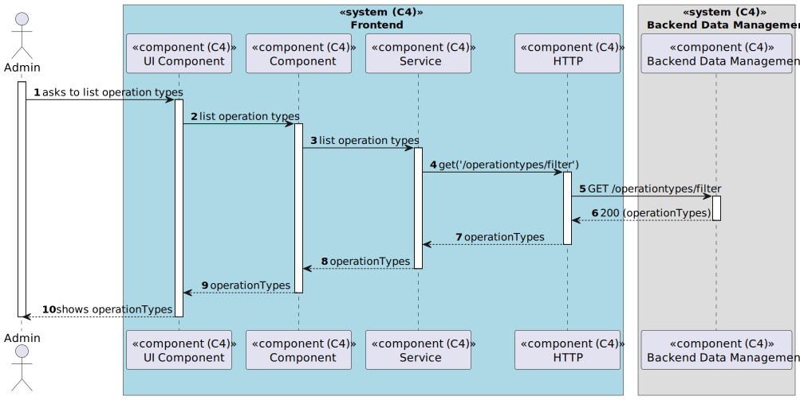

# US 6.2.21 - List/search operation types

## 1. Context

*In this task it was proposed that a Admin can list/search types of operations.*

## 2. Requirements

**US 6.2.21** As an Admin, I want to list/search operation types, so that I can see the details, edit, and remove operation types.

## 3. Views

### Level 1

### Level 2

### Level 3

