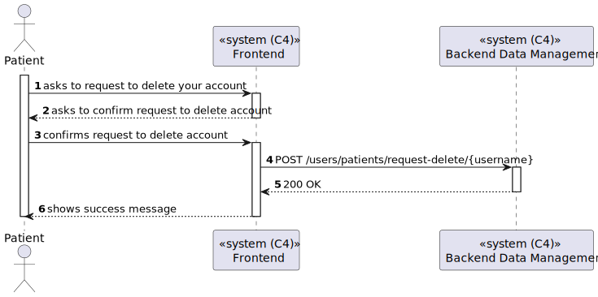

# US 6.2.3 - Delete my account and all associated data

## 1. Context

*In this task it was proposed that a Patient can delete your account and all associated data*

## 2. Requirements

**US 6.2.3** As a Patient, I want to delete my account and all associated data, so that I can exercise my right to be forgotten as per GDPR.

## 3. Views

### Level 1

### Level 2

### Level 3

