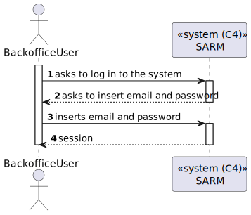
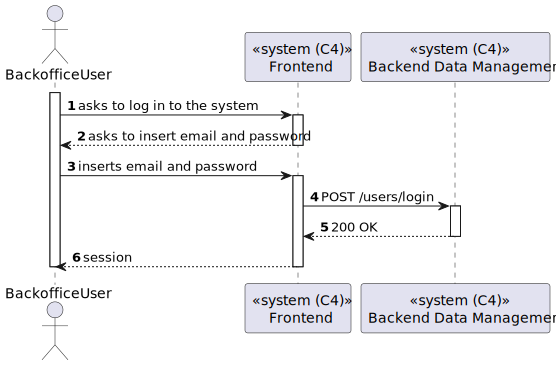
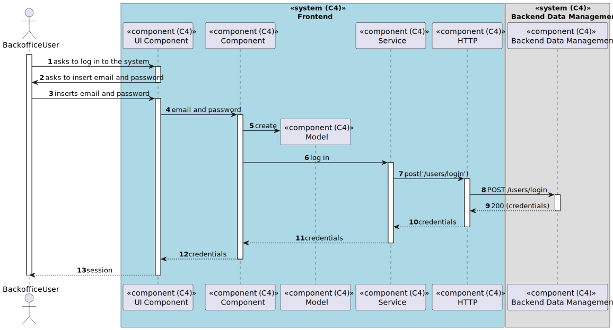

# US 6.2.4 - Login in to the System using credentials

## Context

*In this task it was aksed that an Backoffice User can login in to the System.*

## 2. Requirements

**US 6.2.4**  As a (non-authenticated) Backoffice User, I want to log in to the system using my credentials, so that I can access the backoffice features according to my assigned role.

## 3. Views

### Level 1

### Level 2

### Level 3

