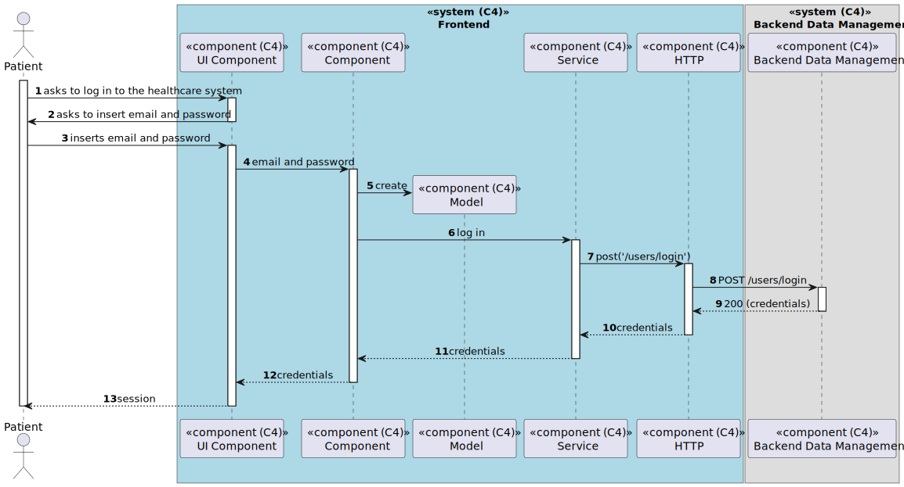

# US 6.2.5 - Log in to the healthcare system

## 1. Context

*In this task it was proposed that a Patient can log in to the healthcare system*

## 2. Requirements

**US 6.2.5** As a Patient, I want to log in to the healthcare system, so that I can access my appointments, medical records, and other features securely.

## 3. Views

### Level 1

### Level 2

### Level 3

