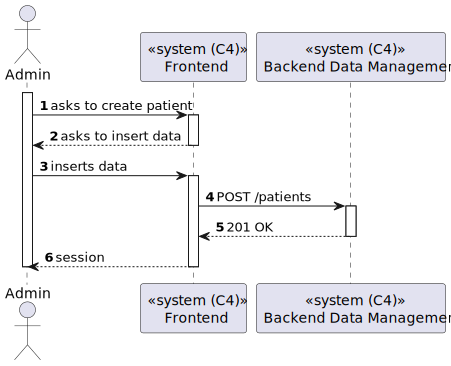
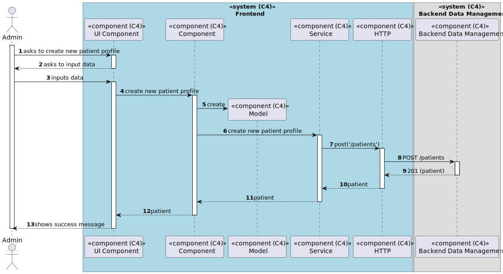

# US 6.2.6 - Create new patient profile

## 1. Context

*In this task it was proposed that an Admin can create a new Patient profile*

## 2. Requirements

**US 6.2.6** As an Admin, I want to create a new patient profile, so that I can register their
personal details and medical history.

## 3. Views

### Level 1

### Level 2

### Level 3

