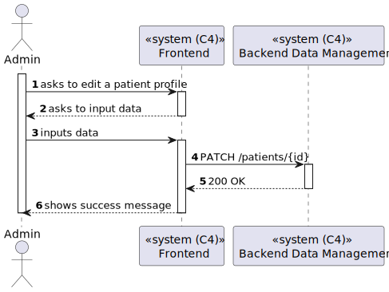
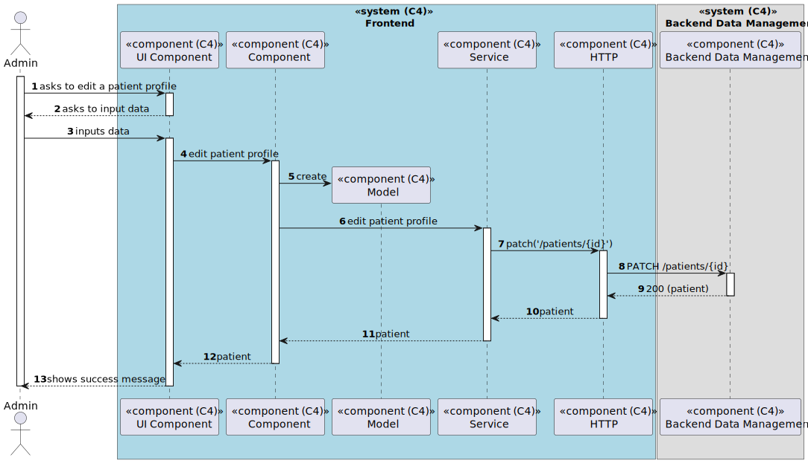

# US 6.2.7 - Edit patient profile

## 1. Context

*In this task it was proposed that an Admin can edit an existing Patient profile*

## 2. Requirements

**US 6.2.7** As an Admin, I want to edit an existing patient profile, so that I can update their
information when needed.

## 3. Views

### Level 1

### Level 2

### Level 3

