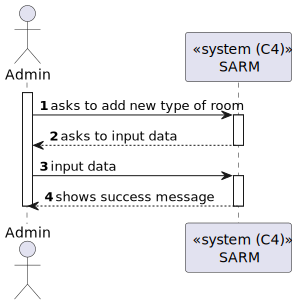
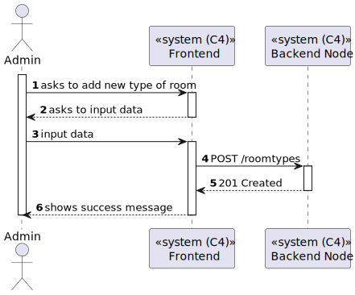
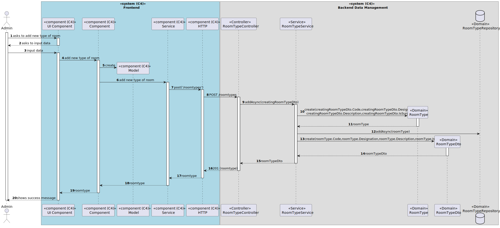

# US 7.2.10 - Add new Types of rooms

## 1. Context

*In this task it was proposed that a Admin can add new Types of rooms.*

## 2. Requirements

**US 7.2.10**As an Admin, I want to add new Types of rooms, so that I can reflect on the available medical procedures in the system.

## 3. Views

### Level 1

### Level 2

### Level 3

