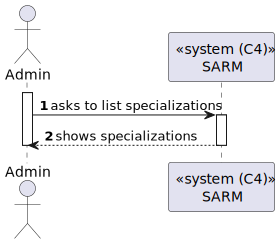
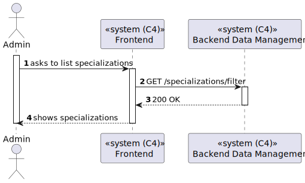
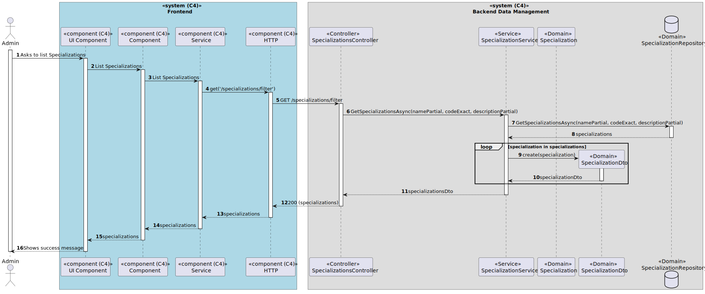

# US 7.2.12 - List Specializations

## 1. Context

*In this task it was asked that an Admin can list/search Specializations.*

Filters by:
- Code (exact);
- Designation/name (partial);
- Description (partial).

## 2. Requirements

**US 7.2.12** As an Admin, I want to list/search Specializations, so that I can see the details, and edit Specialization.

## 3. Views

### Level 1

### Level 2

### Level 3

