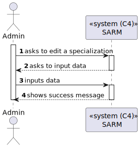
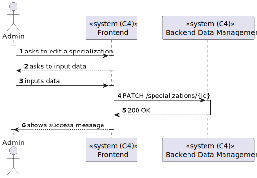
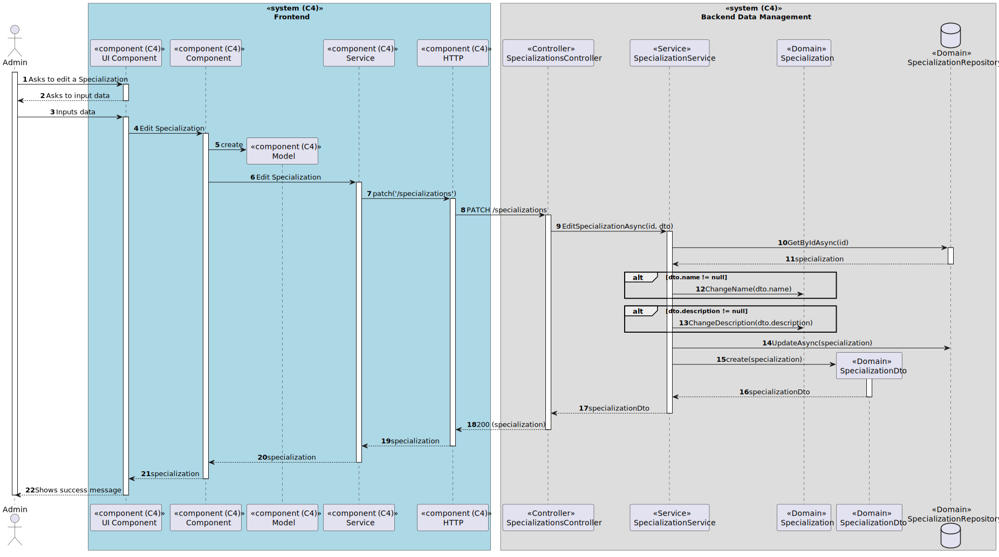

# US 7.2.13 - Edit Specializations

## 1. Context

*In this task it was asked that an Admin can edit Specializations.*

## 2. Requirements

**US 7.2.13** As an Admin, I want to edit Specializations, so that I can update or correct information about the staff and operation type (procedure).

## 3. Views

### Level 1

### Level 2

### Level 3

