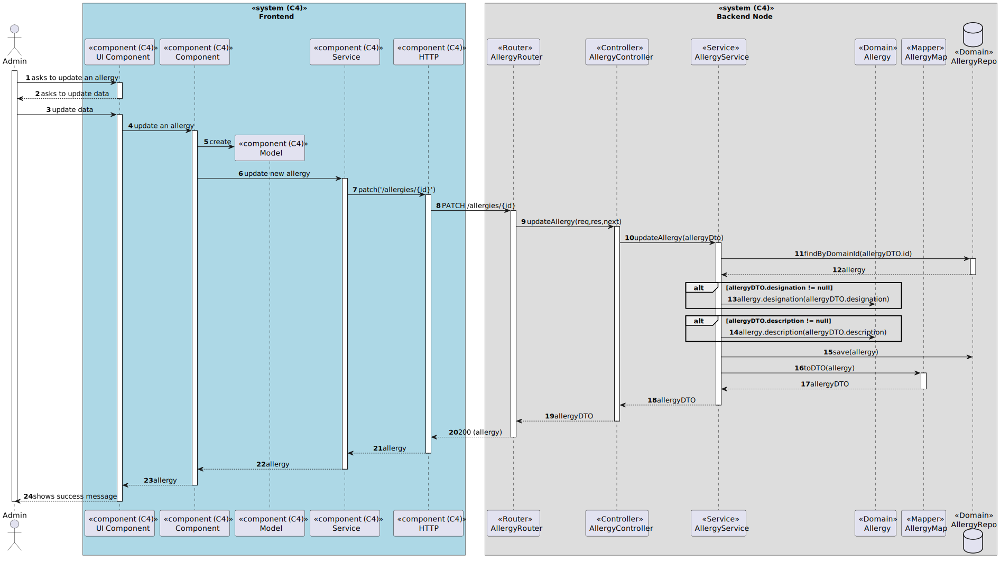

# US 7.2.3 - Search for Allergies

## 1. Context

*In this task it was proposed that an Admin can update an allergy.*

## 2. Requirements

**US 7.2.3** As Admin I want to update an allergy.

 - Admin can update the designation and the description of an allergy.

## 3. Views

### Level 1

### Level 2

### Level 3

