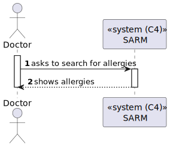
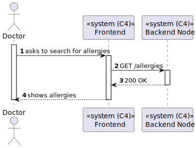
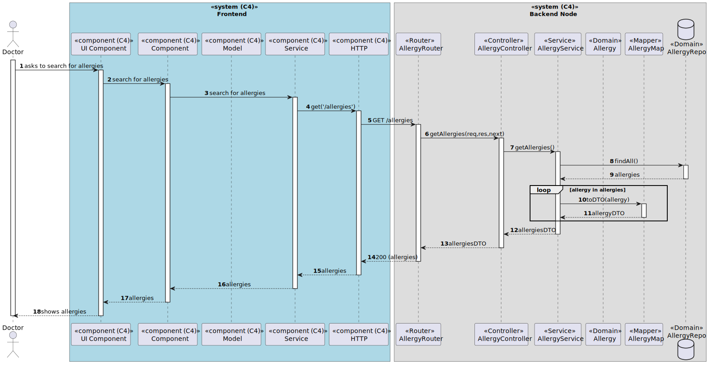

# US 7.2.3 - Search for Allergies

## 1. Context

*In this task it was proposed that a Doctor can search for Allergies.*

## 2. Requirements

**US 7.2.3** As a Doctor, I want to search for Allergies, so that I can use it to update the Patient Medical Record.

## 3. Views

### Level 1

### Level 2

### Level 3

