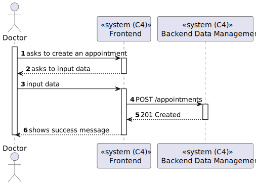

# US 7.2.10 - Create a Surgery Appointment

## 1. Context

*In this task it was proposed that a Admin can create a surgery appointment.*

## 2. Requirements

**US 7.2.8** As a Doctor, I want to create a Surgery Appointment, so that the Patient doesn’t need to wait for the automatically generated planning.

## 3. Views

### Level 1

### Level 2

### Level 3

