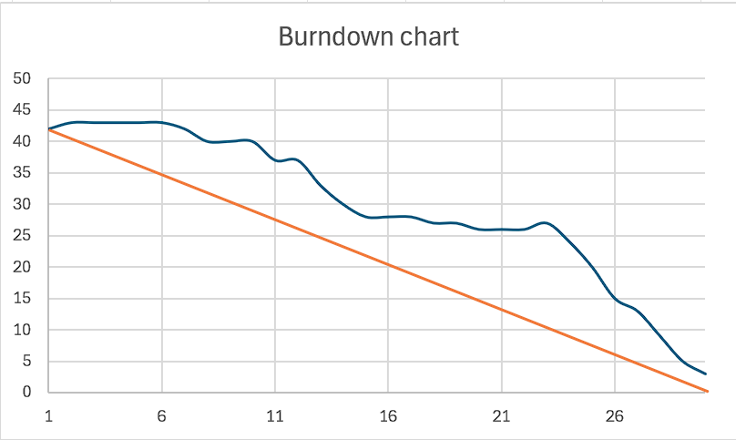

# Sprint B Retrospective

##  O que correu bem?

- Boa colaboração entre todos os membros da equipa.
- Bom compromisso de todos os membros da equipa perante o trabalho.
- Trabalho consistente durante o sprint

## O que correu mal?

- Não conseguimos terminar todas as tarefas propostas, porém praticamente todas foram realizadas.
- Bloqueios na realização de certos requisitos (por exemplo: ALGAV), que levou a alguma gestão de tempo.

## O que podemos melhorar?

- Gerir melhor o tempo.
- Priorizar as tarefas.

## Burndown Chart

